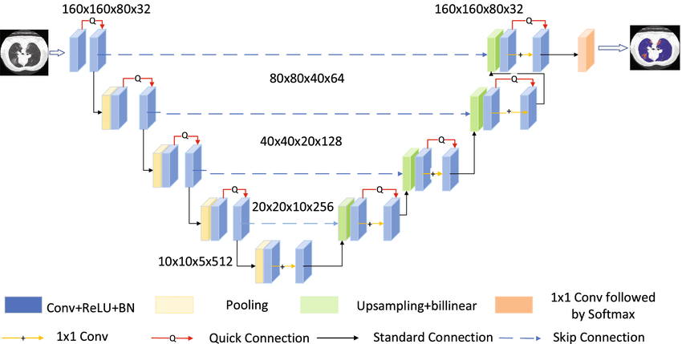
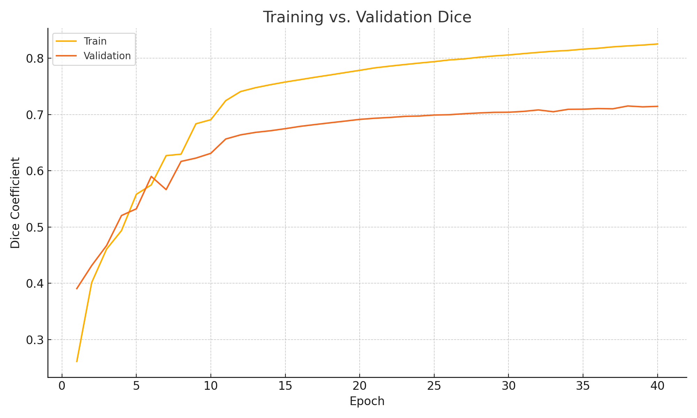
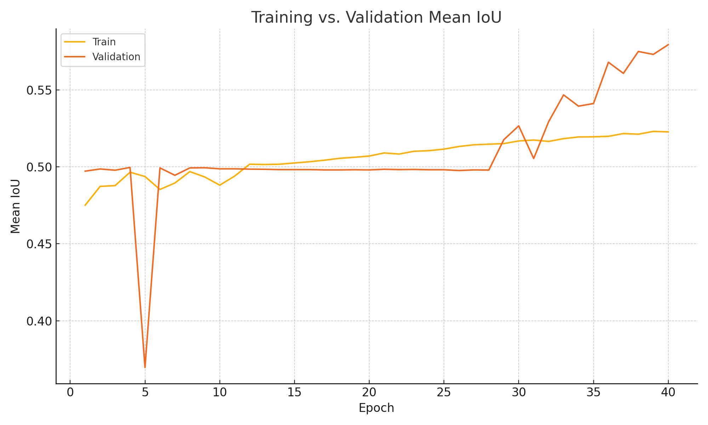
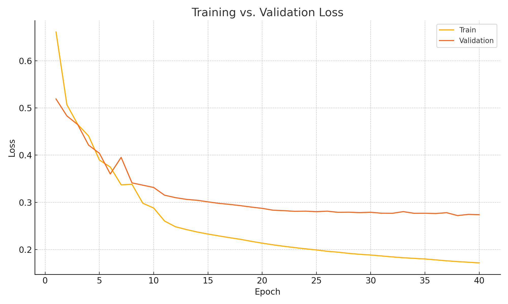
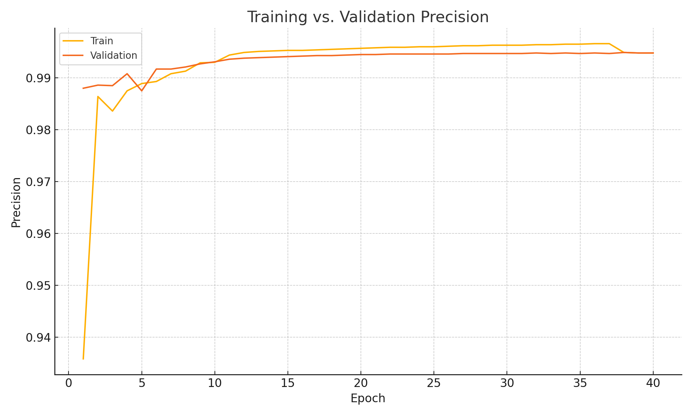
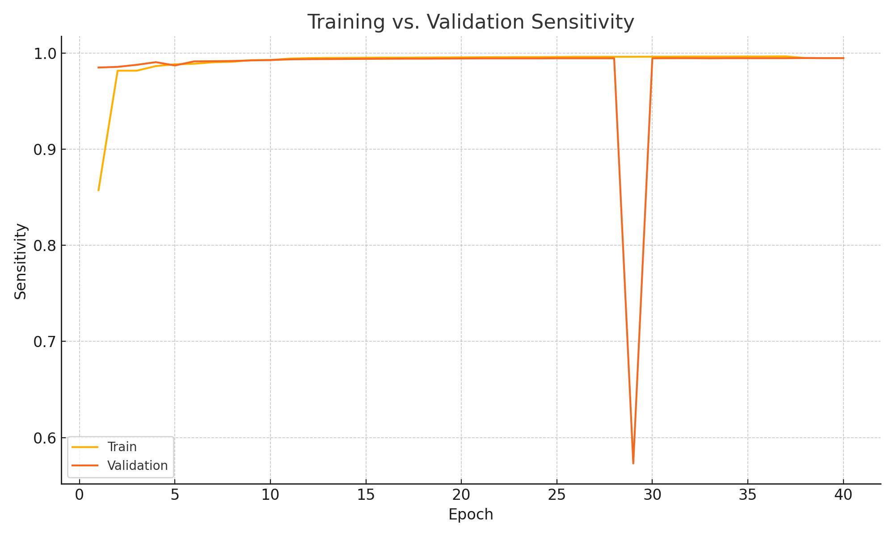
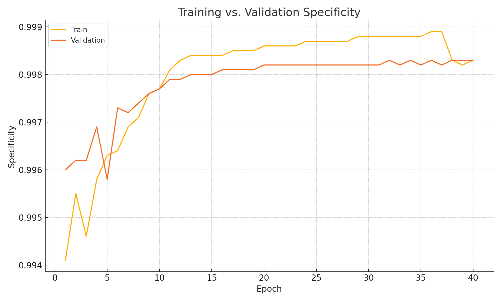

**Project Title: Brain Tumor Segmentation**

 

---

## 📖 Introduction

A deep-learning pipeline for **brain tumor segmentation** on the BraTS dataset. We segment three tumor sub-regions:

* **Whole Tumor (WT)**
* **Tumor Core (TC)**
* **Enhancing Tumor (ET)**

Format of photos used: T1, T1Gd, T2, FLAIR.

---

## 🏗️ Architecture



We employ a 3D U-Net (UNet3D) architecture for volumetric brain tumor segmentation. This model processes the full 3D MRI volumes directly, preserving spatial context across slices. Key components:

1. **Encoder**: Four 3D convolutional downsampling blocks (Conv3D → ReLU → MaxPool3D)
2. **Bottleneck**: Dilated 3D convolution layers for capturing multi-scale context
3. **Decoder**: Four 3D upsampling blocks with skip-connections to recover spatial resolution
4. **Attention Gates**: Integrated on skip paths to refine feature selection and suppress irrelevant activations

---

## 🛠️ Setup & Installation

**Prerequisites**

```bash
python >=3.8
pip install -r requirements.txt
```

**Data**

Download BraTS 2020 dataset from \[[kaggle website](https://www.kaggle.com/datasets/awsaf49/brats20-dataset-training-validation)].

---

## 📊 Benchmarks & Metrics









---

## ⏱️ Runtime & Resources

* **GPU**: NVIDIA Tesla V100, 16 GB VRAM
* **Training time**: \~2 hours / epoch
* **Inference speed**: \~0.5 sec / volume on GPU

---

## 🗂️ Repository Structure

```
├── assets/               # figures, diagrams, sample outputs
├── data/                 # raw & preprocessed data
├── src/                  # training, evaluation scripts
├── notebooks/            # exploratory analysis
├── results/              # trained models, logs, predictions
├── requirements.txt
└── README.md
```

---

## 📝 License

This project is released under the **MIT License**.

---

## 🤝 Contributing & Contact

* **Author**: Your Name ([email@example.com](mailto:email@example.com))
* **Acknowledgements**: Thanks to the MICCAI BraTS organizers and the research community.

Feel free to open issues or PRs for improvements!
